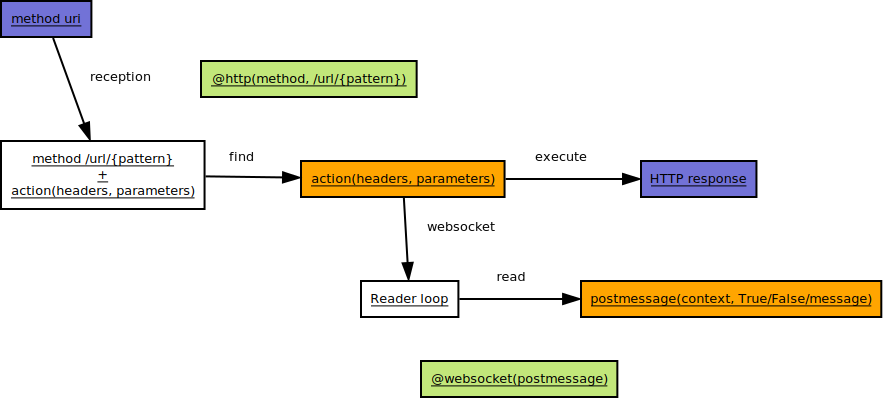
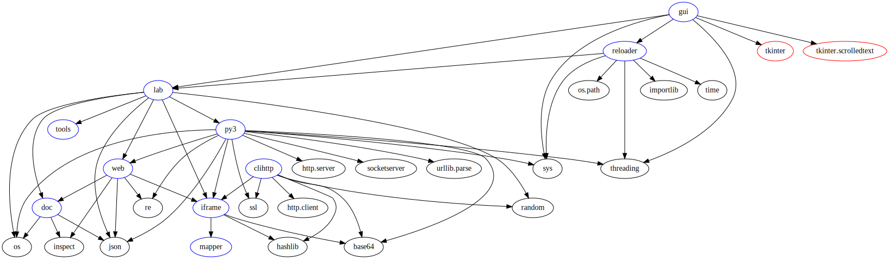


Version : alplha-0.1

# TODO
Liste de choses à faire :
    - pack : extraire le fichier lab.py pour chargement à chaud
    - code : exceptions - séparer exception client et serveur
	- code : gui - push vers fichier et garder les 1000 dernières écritures par exemple

	 
Liste de choses à faire pour les `conforts` :
	- codage : utilisation de classes pour les réponses et le handler WS
	- documentation : recherche
	- documentation : masquage, regroupement 


Valeurs de enctype pour le POST :
	- "application/x-www-form-urlencoded" (par défaut)
	- "text/plain"
	- "multipart/form-data"
    

Liste des choses faites :
	- documentation : ajuster la largeur des images : `@@CSS &lt;règles css&gt;`

# Présentation
Ce projet propose la mise en place d'un serveur web allégé.
Les fonctionnalités prises en charge par ce serveur sont les suivantes :
- requêtes HTTP (GET, POST, PUT, DELETE)
- WebSocket `version 13` de la `RFC 6455` (sans support des extensions)




Format des réponses

[code, headers, bytes_content, callback, callbackCtx]

Les 2 derniers paramètres sont dédiés aux WebSockets : callback(socket, callbackCtx), callbackCtx

# Modules
Liste des modules :
- `[iframe](iframe.html)` : rfc 6455, upgrade et frames des messages (sans extension)
- `[mapper](mapper.html)` : encapsulation de la socket pour lecture en tant que liste
- `[web](web.html)` : mapping URI/fonction sous la forme d'annotations de fonctions
- `[py3](py3.html)` : serveur HTTP, dépend de `web` pour les actions.
- `[reloader](reloader.html)` : permet de rechercher les modules depuis le répertoire courant.
- `[lab](lab.html)` : exemple d'utilisation du serveur
- `[doc](doc.html)` : générer la documentation des fichiers py depuis le répertoire courant

# Points
## Firefox
### Markdown
Lancer Firefox avec l'argument -P pour créer un nouveau profil.
### Nightly
```
sudo add-apt-repository ppa:ubuntu-mozilla-daily/ppa
sudo apt-get update
sudo apt-get install firefox-trunk 
```
## Documentation
Basée sur le fichier test.html => A étoffer.

Prévoir un plugin firefox pour faciliter les tests et traduire le développement.

Test automatique.
## Sécurité
Applicatif :
- Gestion des autorisations -> par annotation
- Gestion du cookie de session => calculer clé, lire cookie
- Mise en place de filtres -> à partir de la clé
- Protection contre la noyade

## Lancement
Problème port socket server utilisée apres l'arret
## Websocket
Gestion en dehors du serveur => gestion applicative
Bus de messages à mettre en place pour controler les WS :
 - arret du serveur par exemple
 - broadcast (possibilité de gestion via un contexte)


